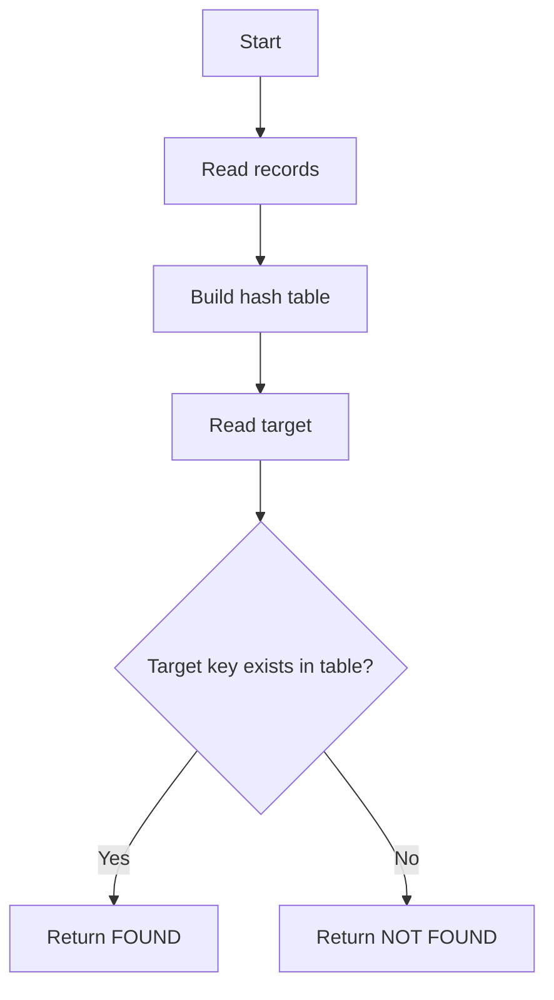

# Task 1 — Flowcharts

## Algorithm 1: Linear Search

```mermaid
flowchart TD
    A[Start] --> B[Read records and target]
    B --> C[i = 0]
    C --> D{records[i] == target?}
    D -- Yes --> E[Return FOUND]
    D -- No --> F{i < n-1?}
    F -- Yes --> G[i = i + 1]
    G --> D
    F -- No --> H[Return NOT FOUND]
```

## Algorithm 2: Recursive Binary Search

```mermaid
flowchart TD
    A[Start] --> B[Set low and high]
    B --> C{low > high?}
    C -- Yes --> D[Return NOT FOUND]
    C -- No --> E[Compute mid]
    E --> F{records[mid] == target?}
    F -- Yes --> G[Return FOUND]
    F -- No --> H{target < records[mid]?}
    H -- Yes --> I[Recurse on left half]
    H -- No --> J[Recurse on right half]
    I --> C
    J --> C
```

## Algorithm 3: Hash Table Search


